# Post-Mon Workshop

This repo is designed to be used in tandem with a workshop/live demo for students on how to use [Postman](https://www.postman.com/)

I've also published the [completed request collection](https://www.postman.com/altimetry-astronomer-34778570/workspace/public-postman-pokemon/overview) for this workshop. You can fork the collection and play around with it yourself

## Table of Contents

- [Requirements](#requirements)

- [What is Postman?](#what-is-postman?)

- [Start Local Pokemon Server](#start-local-pokemon-server)

- [Creating Your First Request](#creating-your-first-request)

- [Make More Requests](#make-more-requests)

- [Adding Shared Authentication](#adding-shared-authentication)

- [Using Global Variables](#using-global-variables)

- [Using Different Environments](#using-different-environments)

- [Creating Tests](#creating-tests)

- [Creating A Mock Server](#creating-a-mock-server)

- [More Exploration](#more-exploration)

- [API Reference](#api-reference)

## Requirements

- Please sign up for an account at [Postman](https://www.postman.com/)
- Download and install the [Postman Desktop](https://www.postman.com/downloads/) app for your system
  - _If you prefer not to download the app you may use Postman's web interface_
- Node v14.0.0 or greater

## What is Postman?

Postman is a tool designed to help test and build APIs. It has a ton of features but for our purposes we are most interested in Postman's tools for generating HTTP requests and displaying the result/response of those requests. Postman makes it easy to create a new request, assign it a Method (GET, POST etc.) and a URL then within seconds you can be sending an HTTP request and see a nicely formatted output of the response. Postman also supports adding all kinds of parameters and gives you an easy interface for modifying/adding/subtracting parameters.

### Why use Postman?

When you are working on a server or building out some kind of API its essential to be able to test out your routes quickly. Postman gives you simple interface to generate HTTP requests and test out your routes. It also saves the requests so you can easily come back to your old requests over and over again as your project develops.

It is also an easy and fast way to test out a new API that you may not have used before. Since there is no coding involved you can just open up a new request in Postman and start testing out the various endpoints of an API you aren't familiar with.

## Start Local Pokemon Server

This repo includes a simple server with a RESTful API that interacts with a database that contains the 151 original Pokemon. To practice using Postman we are going to create requests for this Pokemon API.

1. From the repo's root directory enter the command:

```
npm install
```

2. Next start the server with the command:

```
npm run start-dev
```

3. This will start the repo using _nodemon_ in debugger mode so Chrome's DevTools can be attached
4. You should see output on your command line informing you of the URL the server is running on. By default it is `http://localhost:3000`

Now lets start testing out our server with Postman!

## Creating Your First Request

In Postman

- Create a new workspace and call it 'Postman Pokemon'
- Create a new collection and call it 'Pokemon'
- Inside the 'Pokemon' collection add a new `GET` request to `/api/pokemon` and call it 'Get All Pokemon'. Don't forget to include the host `http://localhost:3000` in all your request URLs
  - After trying out the request add a query parameter called 'type' and use the value 'Psychic'
  > Keeping your requests organized in folders is a good idea because it can help simplify adding authentication and you might want to revisit some of your requests later.

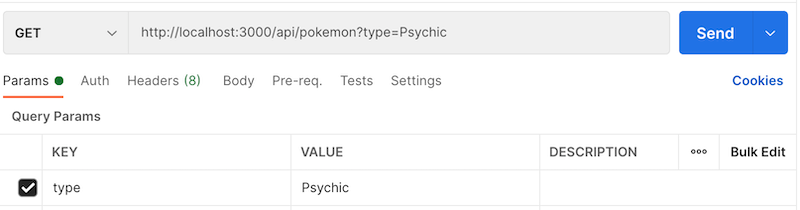
Your GET request should look like this in Postman. Note the check box next to 'type' can be used to add/remove that parameter from the request.

## Make More Requests

- Make a `GET` request to `/api/pokemon/:number`
  - Notice the different in adding a query parameters vs a path variable
  - Send a request asking for Pokemon number 1
- Make a new `DELETE` request to `/api/pokemon/:number`
  - Send a request to delete Pokemon number 1
- Make a new `POST` request to `/api/pokemon`
  - Add the following to the POST request body:
  ```JSON
  {
    "number": 1,
    "name": "Bulbasaur",
    "types": [
        "Grass",
        "Poison"
    ],
    "imageUrl": "http://vignette4.wikia.nocookie.net/nintendo/images/4/43/Bulbasaur.png/revision/latest?cb=20141002083518&path-prefix=en"
  }
  ```
- Make a new `PUT` request to `/api/pokemon/:number`
  - Add the following to the PUT request body:
  ```JSON
  {
    "name":"Knot-A-Mon",
    "types": ["Normal"]
  }
  ```
- Make a new `GET` request to `/api/reset`
  - This endpoint restores the Pokemon database back to the original 151 Pokemon

|  |  | 
| --- | --- |
| 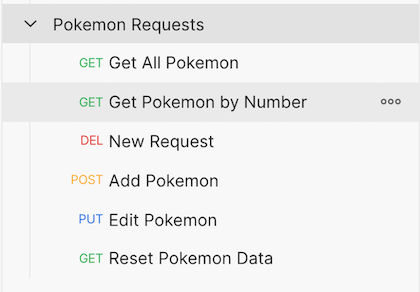 | You should now have a collection with 6 requests that looks like this |
## Adding Shared Authentication

### Update Server Code
1. In `server/index.js` uncomment line 23 then save all your changes. The server should restart automatically since nodemon is watching the files
2. You can test if the API key validation is working by sending one of your previously made requests. The request's response should have an error code with a message along the lines of _'Invalid API key!'_

The API is now secured with an API key. The key is in `server/apiKey.js`

### Add the API key to your existing `GET /api/pokemon` request
The server is looking for a header parameter key of 'api_key' and a value:
  ```
  F8CHMnEeBZh4ph0DuiWbbrT1ZRlGkszf
  ```
> You can add header parameters in the 'Auth' tab of a request

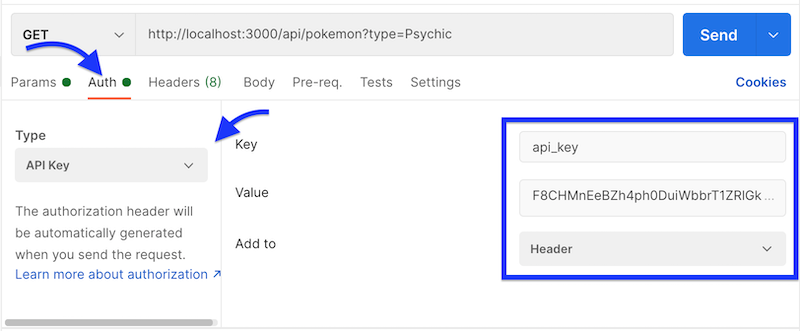
After you have tested this change the 'Type' dropdown back to 'Inherit auth from parent'
### Add authentication to the entire 'Pokemon' collection
This lets you apply authentication to all requests inside the collection so you don't have to adjust each request.
- Select the collection with all your requests and navigate to the 'Authorization' tab
- Just like above fill out the key and value like we did above.

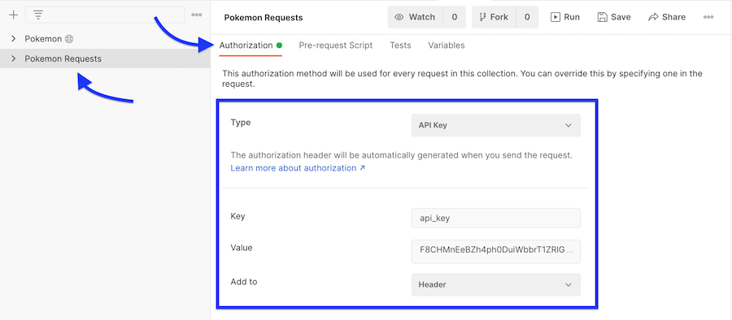

Now all the requests in the collection have the necessary authentication for our server.

## Using Global Variables

- Instead of hard coding the api key use a global variable
  - [Create a global](https://learning.postman.com/docs/sending-requests/variables/#variables-quick-start) variable and call it 'pmApiKey'
  - Navigate back to the 'Authorization' tab of the collection and replace the contents of the 'Value' field with `{{pmApiKey}}`
  - The double curly brackets is how you use variables in Postman

You can store all kinds of things as global variables not just API keys.
## Using Different Environments

We have a deployed paired down version of our server running on Heroku and we want to be able to test those request as well.  It would be great to not have to re-write our requests and instead just tell Postman to send them to a different host. This is where environments can be helpful

- Make a local environment with two variables 'host' and 'apiKey'
  - For 'host' use the host address of your local server - `http://localhost:3000`
  - For 'apiKey' use the API key you created for your server
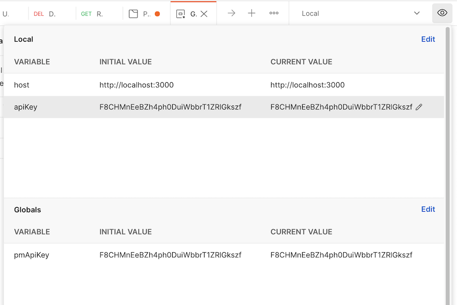
- Refactor your requests to use the new variables
  - You can now use `{{host}}` instead of `http://localhost:3000` in your request URL
  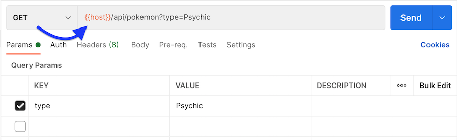
  - Don't forget to replace the authentication 'Value' field in the collection with your new environment variable `{{apiKey}}`
  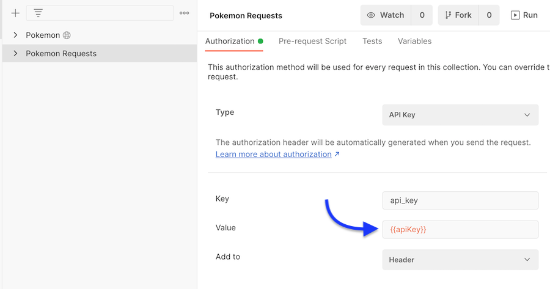
- Make a new environment called 'deployed' with two variables 'host and 'apiKey'
  - host should be: `https://gen1-pokemon.herokuapp.com`
  - apiKey should be: `So5aVM3sYecOwHrjSp67sKUFDXtvVYF6`

Now you can easily swap between the local and deployed environments using the drop down in the top right of the Postman window.  
## Creating Tests
Postman lets you easily create tests for your requests.

- Switch back to your local environment in Postman
- Send a `GET /api/reset` request to restore the DB back to its original state
- In your `GET /api/pokemon` request add a test that confirms the response message is 200
- Add a second test that confirms the response is an array of length 151
>Postman has a bunch of handy code snippets that you can use to base your tests off of. Make use of those snippets!

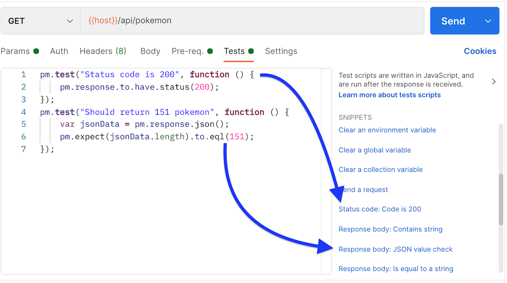
## Creating A Mock Server

- In Postman [create a new mock server](./readme_images/env-variable-auth.png) from your Pokemon collection
- Create a new environment called 'mock' with one variable 'host' which is the address of your new mock server.
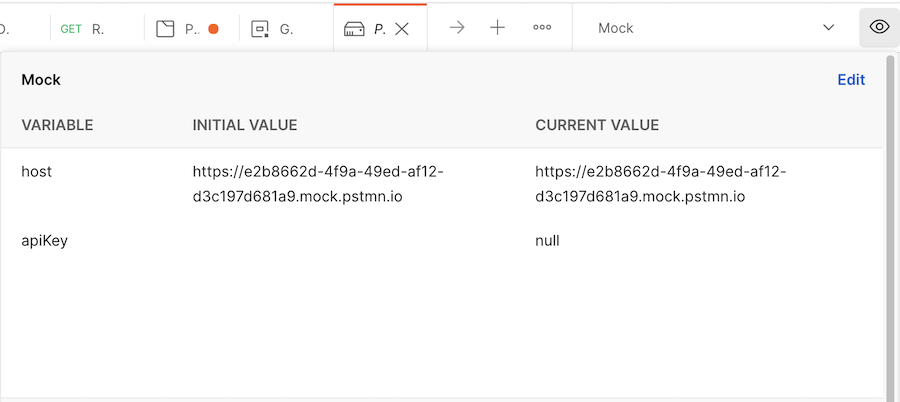
- Make a [new example response](./readme_images/env-variable-auth.png) from your `GET /api/pokemon` request
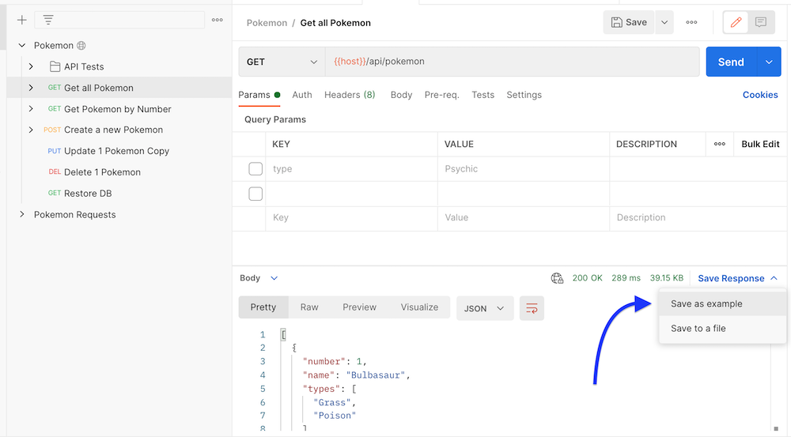
- Change to the 'mock' environment and test if you get the example response
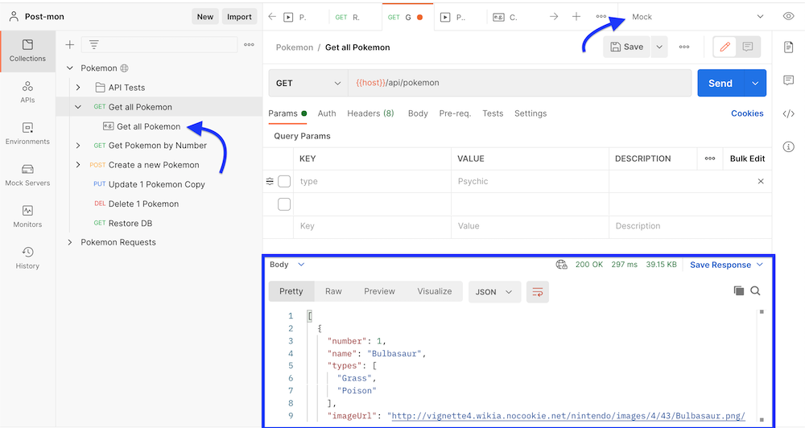

# More Exploration

- You can find the Postman workspace I made for this workshop [here](https://www.postman.com/altimetry-astronomer-34778570/workspace/public-postman-pokemon/overview)
- [Postman Learning Center](https://learning.postman.com/docs/getting-started/introduction/)
- [Postman Variables Quick Start](https://learning.postman.com/docs/sending-requests/variables/)
- [Postman Environment Quick Start](https://learning.postman.com/docs/sending-requests/managing-environments/)
- [Postman Writing Tests](https://learning.postman.com/docs/writing-scripts/test-scripts/)
- [Postman Setting Up Mock Servers](https://learning.postman.com/docs/designing-and-developing-your-api/mocking-data/setting-up-mock/)

# API Reference

Here you can find documentation for the Pokemon server. Note that the deployed version only supports two routes.

- [Local Pokemon API](#local-pokemon-api)

- [Deployed Pokemon API](#deployed-pokemon-api)

## Local Pokemon API

- [List All Pokemon](#list-all-Pokemon)

- [Get Pokemon By Number](#get-pokemon-by-number)

- [Create A New Pokemon](#create-a-new-pokemon)

- [Update A Pokemon](#update-a-pokemon)

- [Delete A Pokemon](#delete-a-pokemon)

- [Reset Pokemon Data](#reset-pokemon-data)

### List All Pokemon

`GET /api/pokemon` Retrieves a list of Pokemon

Parameters

| Parameters | Type   | In    | Description                                         |
| ---------- | ------ | ----- | --------------------------------------------------- |
| type       | string | query | Specify a Pokemon type ex "Psychic". Case sensitive |
|            |        |       |                                                     |

Response

`Status: 200 OK`

```JSON
[
  {
    "number": 1,
    "name": "Bulbasaur",
    "types": [
        "Grass",
        "Poison"
    ],
    "imageUrl": "http://exampleImage.com/bulbasaur"
  },
  {
    "number": 2,
    "name": "Ivysaur",
    "types": [
        "Grass",
        "Poison"
    ],
    "imageUrl": "http://exampleImage.com/ivysaur"
  },
  ...
]
```

### Get Pokemon By Number

`GET /api/pokemon/:number` Retrieves a list of Pokemon

Parameters

| Parameters | Type   | In   | Description                         |
| ---------- | ------ | ---- | ----------------------------------- |
| type       | number | path | Return Pokemon with matching number |
|            |        |      |                                     |

Response

`Status: 200 OK`

```JSON
{
  "number": 1,
  "name": "Bulbasaur",
  "types": [
      "Grass",
      "Poison"
  ],
  "imageUrl": "http://exampleImage.com/bulbasaur"
}
```

### Create A New Pokemon

`POST /api/pokemon` Create a new Pokemon

Parameters

| Parameters | Type     | In   | Description                          |
| ---------- | -------- | ---- | ------------------------------------ |
| number     | number   | body | Number for the new Pokemon           |
| name       | string   | body | Name for the new Pokemon             |
| types      | [string] | body | Array of types to assign new Pokemon |
| imageURL   | string   | body | URL for an image of the new Pokemon  |

Response

`Status: 201 CREATED`

```JSON
{
  "number": 201,
  "name": "Knot-A-Mon",
  "types": [
    "Grass",
    "Rock"
  ],
    "imageUrl": "http://exampleImage.com/knot-a-mon"
}

```

### Update A Pokemon

`PUT /api/pokemon/:number` Update the Pokemon with matching number

Parameters

| Parameters | Type     | In   | Description                                                       |
| ---------- | -------- | ---- | ----------------------------------------------------------------- |
| number     | number   | path | Number for the Pokemon to update                                  |
| name       | string   | body | [Optional] Updated name                                           |
| types      | [string] | body | [Optional] Array of types for update. Replaces all existing types |
| imageURL   | string   | body | [Optional] Updated URL for Pokemon image                          |

Response

`Status: 201 CREATED`

```JSON
{
  "number": 201,
  "name": "Knot-A-Mon",
  "types": [
    "Normal"
  ],
    "imageUrl": "http://exampleImage.com/knot-a-mon-updated"
}


```

### Delete A Pokemon

`DELETE /api/pokemon/:number` Deletes the Pokemon with matching number

Parameters

| Parameters | Type   | In   | Description                     |
| ---------- | ------ | ---- | ------------------------------- |
| type       | number | path | Number of the Pokemon to delete |

Response

`Status: 204 NO CONTENT`

### Reset Pokemon Data

`GET /api/reset` Reset the data in the database to the original 151 Pokemon

Parameters

No Parameters

Response

`Status: 204 NO CONTENT`

## Deployed Pokemon API

The API is deployed on a free tier account of Heroku, this means that the first time you try to send a request to the API it could take a while to respond while Heroku wakes up the service.

### URL

```
https://gen1-pokemon.herokuapp.com
```

### Authentication

API Key: `So5aVM3sYecOwHrjSp67sKUFDXtvVYF6`

Authentication should be added to the request header at the key `api_key`

### Routes

The deployed API only supports two routes

- [List All Pokemon](#list-all-Pokemon)

- [Get Pokemon By Number](#get-pokemon-by-number)
